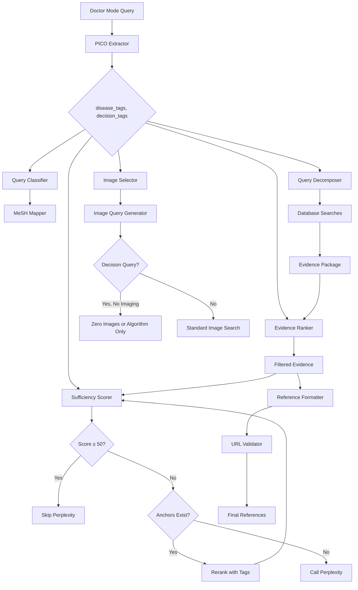

# Design Document: Evidence Brain Quality Fix

## Overview

This design addresses critical quality issues in the MedGuidance Evidence Brain system by implementing a PICO-first architecture. The core principle is that every Doctor Mode query goes through structured PICO extraction first, generating `disease_tags` and `decision_tags` that drive all downstream modules: query classification, MeSH expansion, evidence ranking, sufficiency scoring, image selection, and reference formatting.

The solution ensures:
1. Perplexity is only called when internal evidence is truly insufficient
2. Queries are correctly classified based on extracted tags
3. Long queries are decomposed into focused sub-queries for better search results
4. Images are only shown when directly relevant to the clinical decision
5. Off-topic references are filtered out
6. All references have valid, clickable URLs (no Google search links)

## Architecture



## Components and Interfaces

### 1. PICO Extractor (`lib/evidence/pico-extractor.ts`)

New module that extracts structured PICO components from clinical queries.

```typescript
interface PICOExtraction {
  patient: string;           // Patient/Population description
  intervention: string;      // Primary intervention being asked about
  comparison: string | null; // Comparison intervention if present
  outcome: string;           // Desired outcome
  condition: string;         // Primary medical condition
  
  // Generated tags
  disease_tags: string[];    // e.g., ['AF', 'CKD', 'GI_bleed']
  decision_tags: string[];   // e.g., ['anticoagulation', 'drug_choice', 'monitoring']
  primary_disease_tag: string;
  secondary_disease_tags: string[];
  primary_decision_tag: string;      // Main decision being asked about
  secondary_decision_tags: string[]; // Additional decisions in query
}

interface QueryDecomposition {
  original_query: string;
  sub_queries: SubQuery[];
}

interface SubQuery {
  query: string;           // ≤20 words
  category: 'core_decision' | 'complications' | 'duration_monitoring' | 'alternatives';
  target_evidence: 'guideline' | 'systematic_review' | 'trial' | 'cohort';
}

// Main functions
function extractPICO(query: string): Promise<PICOExtraction>;
function decomposeQuery(query: string, pico: PICOExtraction): QueryDecomposition;
function generateTags(pico: PICOExtraction): { disease_tags: string[], decision_tags: string[] };
```

### 2. Query Classifier (`lib/evidence/query-classifier.ts`)

Enhanced classifier that uses extracted tags instead of raw text pattern matching.

```typescript
type QueryClassification = 
  | 'cardiology/anticoagulation'
  | 'cardiology/heart_failure'
  | 'infectious/pneumonia'
  | 'infectious/sepsis'
  | 'oncology/treatment'
  | 'lifestyle/prevention'
  | 'general';

interface ClassificationResult {
  classification: QueryClassification;
  allowed_mesh_terms: string[];
  excluded_mesh_terms: string[];
  confidence: number;
}

function classifyQuery(
  disease_tags: string[], 
  decision_tags: string[]
): ClassificationResult;
```

### 3. Enhanced Sufficiency Scorer (`lib/evidence/sufficiency-scorer.ts`)

Modified to be anchor-aware and tag-based.

```typescript
interface EnhancedSufficiencyScore {
  score: number;           // 0-100
  level: 'excellent' | 'good' | 'limited' | 'insufficient';
  reasoning: string[];
  anchor_count: number;
  matching_reviews: number;
  matching_trials: number;
  should_call_perplexity: boolean;
  rerank_needed: boolean;
}

function scoreEvidenceSufficiencyWithTags(
  evidence: EvidencePackage,
  disease_tags: string[],
  decision_tags: string[],
  anchor_scenario: string | null
): EnhancedSufficiencyScore;
```

### 4. Enhanced Evidence Ranker (`lib/evidence/evidence-ranker.ts`)

Modified to use tag-based relevance scoring with primary tag prioritization.

```typescript
interface TagBasedRankingConfig {
  disease_tags: string[];
  decision_tags: string[];
  primary_disease_tag: string;
  primary_decision_tag: string;
  secondary_decision_tags: string[];
  anchor_scenario: string | null;
  boost_anchors: boolean;
  penalize_off_topic: boolean;
  min_references: number;  // Default 5, triggers relaxed filtering if below
  max_references: number;  // Default 10, caps final list
}

function rankAndFilterEvidenceWithTags(
  evidence: EvidencePackage,
  config: TagBasedRankingConfig,
  maxItems: number
): EvidencePackage;

function calculateTagRelevance(
  item: EvidenceItem,
  config: TagBasedRankingConfig
): number; // 0-100, <10 means exclude

// Ranking priority:
// 1. Items matching BOTH primary_disease_tag AND primary_decision_tag (highest boost)
// 2. Items matching primary_disease_tag AND any decision_tag
// 3. Items matching primary_disease_tag only
// 4. Secondary_decision_tags used only to break ties
// 5. If <5 references after filtering, include 1-2 broader high-quality reviews
//    that share primary_disease_tag even if decision_tags only partially match
```

### 5. Enhanced Image Selector (`lib/smart-image-query.ts`)

Modified to use tags and respect decision query rules.

```typescript
interface TagBasedImageConfig {
  disease_tags: string[];
  decision_tags: string[];
  has_imaging_modality: boolean;
  is_decision_query: boolean;
}

function generateSmartImageQueriesWithTags(
  userQuery: string,
  config: TagBasedImageConfig,
  mode: 'doctor' | 'general'
): Promise<SmartImageQuery[]>;

function shouldShowImages(config: TagBasedImageConfig): boolean;
```

### 6. Reference Formatter (`lib/evidence/reference-formatter.ts`)

New module for proper reference formatting with validated URLs.

```typescript
interface FormattedReference {
  title: string;
  url: string;              // Direct article URL, never Google search
  authors: string;          // "First Author et al." if >3
  journal: string;
  year: string;
  source_badge: SourceBadge;
  quality_badges: QualityBadge[];
  pmid?: string;
  doi?: string;
}

type SourceBadge = 'PubMed' | 'Cochrane' | 'Clinical Trial' | 'Guideline' | 
                   'Meta-Analysis' | 'Systematic Review' | 'PMC' | 'Europe PMC';

type QualityBadge = 'Gold Standard' | 'Recent' | 'Highly Cited' | 
                    'Practical Guidance' | 'Landmark Trial' | 'Anchor Guideline';

function formatReference(item: EvidenceItem): FormattedReference | null;
function validateReferenceURL(url: string): boolean;
function isGoogleSearchURL(url: string): boolean;
function getDirectArticleURL(item: EvidenceItem): string | null;
```

## Data Models

### Tag Definitions

```typescript
// Disease tags - extracted from queries
const DISEASE_TAGS = {
  // Cardiovascular
  'AF': ['atrial fibrillation', 'afib', 'a-fib', 'af'],
  'CKD': ['chronic kidney disease', 'ckd', 'renal insufficiency', 'egfr'],
  'HF': ['heart failure', 'hfref', 'hfpef', 'chf'],
  'CAD': ['coronary artery disease', 'cad', 'ischemic heart'],
  
  // Infectious
  'CAP': ['community-acquired pneumonia', 'cap', 'pneumonia'],
  'SEPSIS': ['sepsis', 'septic shock', 'bacteremia'],
  
  // GI
  'GI_BLEED': ['gi bleed', 'gastrointestinal bleed', 'upper gi bleed', 'ugib'],
  
  // Metabolic
  'DIABETES': ['diabetes', 'dm', 't2dm', 'diabetic'],
  'HTN': ['hypertension', 'high blood pressure', 'htn'],
} as const;

// Decision tags - extracted from queries
const DECISION_TAGS = {
  'anticoagulation': ['anticoagulation', 'anticoagulant', 'warfarin', 'apixaban', 'doac'],
  'drug_choice': ['which drug', 'preferred agent', 'first-line', 'drug of choice'],
  'duration': ['how long', 'duration', 'length of treatment'],
  'de-escalation': ['de-escalation', 'step down', 'switch', 'transition'],
  'monitoring': ['monitor', 'follow-up', 'surveillance'],
  'dose': ['dose', 'dosing', 'mg', 'dosage'],
} as const;
```

### Classification Rules

```typescript
const CLASSIFICATION_RULES: ClassificationRule[] = [
  {
    disease_tags: ['AF'],
    decision_tags: ['anticoagulation', 'drug_choice', 'dose'],
    classification: 'cardiology/anticoagulation',
    allowed_mesh: ['Atrial Fibrillation', 'Anticoagulants', 'Stroke', 'Hemorrhage', 'Kidney Failure, Chronic'],
    excluded_mesh: ['Primary Prevention', 'Diabetes Mellitus', 'Exercise', 'Diet'],
  },
  {
    disease_tags: ['CAP', 'SEPSIS'],
    decision_tags: ['drug_choice', 'duration'],
    classification: 'infectious/pneumonia',
    allowed_mesh: ['Pneumonia', 'Anti-Bacterial Agents', 'Sepsis'],
    excluded_mesh: ['Cardiovascular Diseases', 'Diabetes Mellitus'],
  },
  {
    disease_tags: ['CAD', 'PCI'],
    decision_tags: ['antiplatelet', 'duration', 'de-escalation'],
    classification: 'cardiology/dapt',
    allowed_mesh: ['Platelet Aggregation Inhibitors', 'Coronary Artery Disease', 'Hemorrhage'],
    excluded_mesh: ['Primary Prevention', 'Diabetes Mellitus'],
  },
  {
    disease_tags: ['HF', 'HFpEF', 'HFrEF'],
    decision_tags: ['drug_choice', 'therapy'],
    classification: 'cardiology/heart_failure',
    allowed_mesh: ['Heart Failure', 'Sodium-Glucose Transporter 2 Inhibitors', 'Diuretics'],
    excluded_mesh: ['Primary Prevention'],
  },
  // ... more rules for AHRE, etc.
];

// Recognized anchor scenarios for sufficiency calculation
const ANCHOR_SCENARIOS = [
  'af_ckd_anticoagulation',
  'cap_sepsis_antibiotics',
  'dapt_hbr',
  'hfpef_ckd',
  'ahre_anticoagulation',
  'gi_bleed_anticoagulation_restart',
] as const;
```

## Correctness Properties

*A property is a characteristic or behavior that should hold true across all valid executions of a system-essentially, a formal statement about what the system should do. Properties serve as the bridge between human-readable specifications and machine-verifiable correctness guarantees.*

### Property 1: PICO Extraction Produces Valid Tags
*For any* valid medical query in Doctor Mode, PICO extraction SHALL produce at least one disease_tag OR one decision_tag, and the primary_disease_tag SHALL be non-empty when disease_tags is non-empty.
**Validates: Requirements 1.1, 1.2, 1.4**

### Property 2: Long Query Decomposition
*For any* clinical query exceeding 100 words, the decomposition function SHALL produce 3-4 sub-queries where each sub-query is ≤20 words and contains at least one disease term from the original query's disease_tags.
**Validates: Requirements 2.1, 2.2, 2.3**

### Property 3: Tag-Based Classification Restricts MeSH
*For any* query where disease_tags includes 'AF' AND decision_tags includes 'anticoagulation', the classification SHALL be 'cardiology/anticoagulation' AND the allowed_mesh_terms SHALL NOT contain 'Primary Prevention' or 'Diabetes Mellitus'.
**Validates: Requirements 3.1, 3.2, 3.3**

### Property 4: Anchor-Aware Sufficiency Scoring
*For any* evidence package containing ≥3 anchor guidelines matching the query's anchor scenario, the sufficiency score SHALL be ≥70 (GOOD level).
**Validates: Requirements 4.1, 4.2**

### Property 5: Perplexity Blocking
*For any* evidence package with sufficiency score ≥50 OR with a non-empty matching anchor pack, the system SHALL NOT call Perplexity API.
**Validates: Requirements 4.4, 4.5**

### Property 6: Off-Topic Reference Exclusion
*For any* candidate reference whose disease_tags have zero overlap with the query's primary_disease_tags, the relevance score SHALL be <10 AND the reference SHALL be excluded from the final list.
**Validates: Requirements 5.1, 5.3**

### Property 7: Final Reference List Quality
*For any* final reference list, at least 80% of references SHALL have disease_tags overlapping with the query's disease_tags (relaxed to allow broader reviews if <5 references remain), AND when primary studies exist for the scenario, at least 2 primary studies SHALL be included, AND the total count SHALL be 6-10 items.
**Validates: Requirements 5.4, 5.5, 5.6, 5.7**

### Property 8: Decision Query Image Suppression
*For any* treatment/management query (CAP duration, DAPT decisions, HFpEF therapy, AF anticoagulation, etc.) where decision_tags includes 'drug_choice', 'anticoagulation', 'duration', or 'therapy' AND the query contains no imaging modality terms, the image count SHALL be 0 unless a decision algorithm matching disease_tags + decision_tags is found. Generic teaching images (ECG, CXR, spectrum charts) SHALL never be returned for pure management questions.
**Validates: Requirements 6.1, 6.3, 6.5**

### Property 9: Tag-Derived Image Queries
*For any* image search query generated for a Doctor Mode query, the search string SHALL contain at least one term from disease_tags AND at least one term from decision_tags (when decision_tags is non-empty).
**Validates: Requirements 6.2, 6.4**

### Property 10: Anchor Citation URL Integrity
*For any* anchor guideline or landmark trial included in the final reference list, the URL SHALL match the pre-stored URL in the anchor/landmark database AND SHALL NOT be a Google search URL.
**Validates: Requirements 7.1, 7.2, 9.4**

### Property 11: Reference Format Completeness
*For any* reference in the final formatted list, the reference SHALL contain: non-empty title, valid direct URL (pubmed/pmc/doi/guideline), author string, journal name, publication year, and at least one source badge.
**Validates: Requirements 8.1, 8.2, 8.4**

### Property 12: No Google Search URLs (Round-Trip)
*For any* URL in the final reference list, the URL SHALL NOT contain "google.com/search" - this is a round-trip property where we validate that URL generation → validation → final list produces zero Google URLs.
**Validates: Requirements 9.1, 9.2, 9.3**

## Error Handling

1. **PICO Extraction Failure**: If PICO extraction fails or returns empty tags, fall back to keyword-based tag extraction using regex patterns.

2. **Query Decomposition Failure**: If decomposition fails, use the original query (truncated to 200 chars) for searches.

3. **Sufficiency Scoring Error**: If scoring fails, default to "limited" level and allow Perplexity as fallback.

4. **Reference URL Validation Failure**: If URL validation fails, exclude the reference rather than include a potentially broken link.

5. **Image Search Failure**: If image search fails, return empty array rather than generic fallback images.

## Testing Strategy

### Unit Tests
- Test PICO extraction with various query formats
- Test tag generation from PICO components
- Test classification rules with edge cases
- Test URL validation patterns
- Test reference formatting

### Property-Based Tests
Using `fast-check` library for TypeScript:

1. **PICO Tag Generation**: Generate random medical queries, verify tag extraction produces valid results
2. **Query Decomposition**: Generate long queries, verify decomposition constraints
3. **Classification Consistency**: Generate tag combinations, verify classification is deterministic
4. **Sufficiency Scoring**: Generate evidence packages with varying anchor counts, verify score thresholds
5. **URL Validation**: Generate URLs, verify Google search URLs are always rejected
6. **Reference Completeness**: Generate evidence items, verify formatted references have all required fields

### Integration Tests
- End-to-end test with AF+CKD anticoagulation query
- Verify Perplexity is not called when anchors exist
- Verify no Google URLs in final output
- Verify image suppression for decision queries
